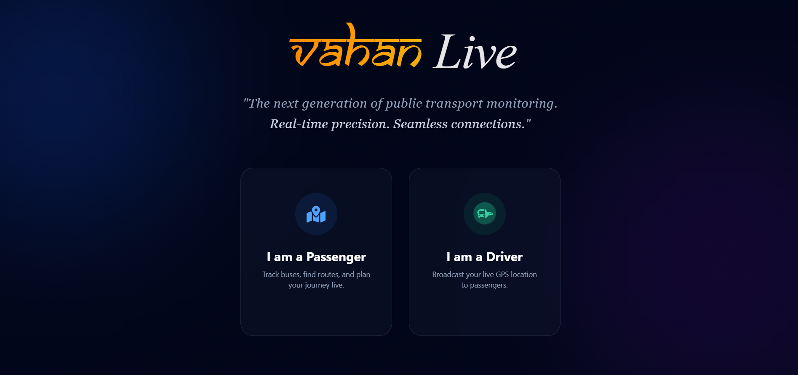
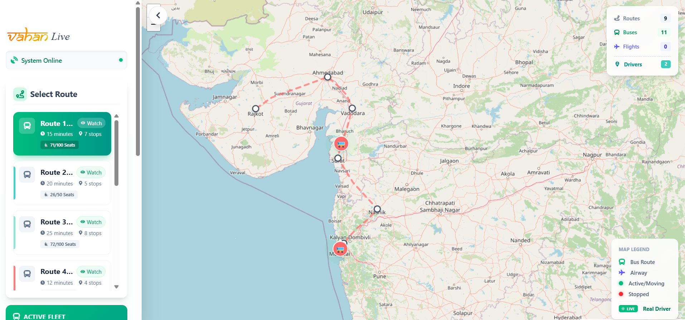
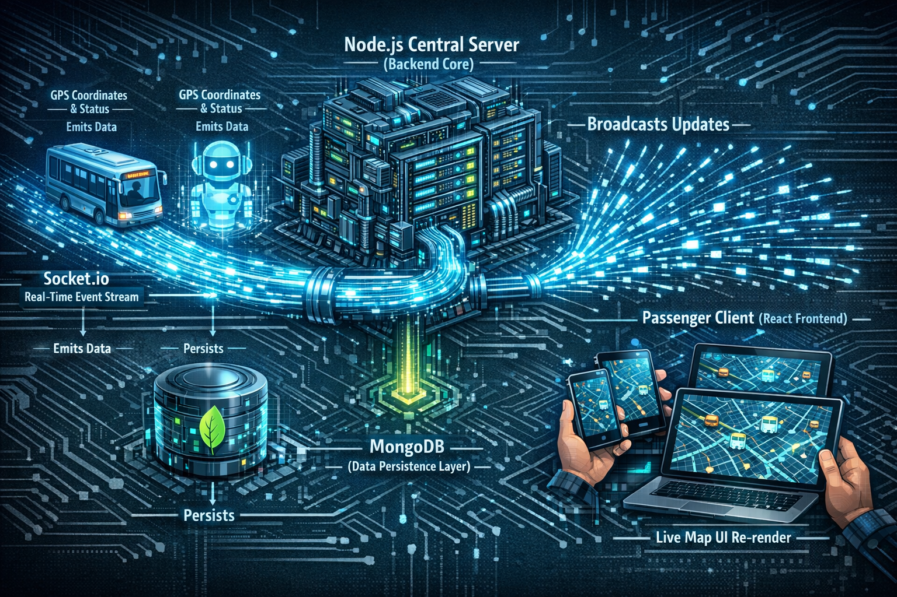

# 🚌 Vahan Live | Real-Time Public Transport Tracking


<div align="center">

[](https://vahan-live.vercel.app/)
[](https://luma.com/9sbv8bie?tk=38r4Cv)
[](LICENSE)

**Eliminating "Blind Waiting" for daily commuters with real-time WebSocket precision.**

</div>

---

## 📖 About The Project

**Vahan Live** is a full-stack real-time tracking application designed to bridge the gap between public transport operators and commuters. By replacing static timetables with live visual data, we ensure passengers never have to guess where their bus is again.

> 🚀 **Hackathon Project:** This project was conceptually designed and built for the **Hackathon Event** hosted at [Luma](https://luma.com/9sbv8bie?tk=38r4Cv).

### 🌟 Why Vahan Live?
* **Zero Hardware Cost:** Uses driver smartphones as GPS beacons.
* **Real-Time Sync:** Sub-second latency updates using **Socket.io**.
* **Scalable:** Built to handle thousands of concurrent connections.
* **Dual-Role System:** Seamless interface switching between *Passenger* and *Driver* modes.

---

## ⚡ Live Demo

Check out the deployed application here:  
👉 **[https://vahan-live.vercel.app/](https://vahan-live.vercel.app/)**

*(Note: If no live buses are visible, the simulation bot is likely offline to save resources. You can run the simulator locally to test!)*

---

## 🎨 Key Features

| Feature | Description |
| :--- | :--- |
| **📍 Live Map Tracking** | Smooth animation of vehicles moving on the map without page refreshes. |
| **🔄 Socket.io Updates** | Instant bi-directional communication between server, drivers, and passengers. |
| **🤖 Simulation Bot** | A built-in Node.js bot that simulates bus traffic for testing and demos. |
| **👥 Dual User Modes** | **Driver Mode** to broadcast location & **Passenger Mode** to view active routes. |
| **📱 Responsive UI** | Glassmorphism design optimized for Mobile and Desktop users. |
| **🔋 Sustainability** | Reduces waiting time and carbon footprint by optimizing commute efficiency. |

---

## 🛠️ Tech Stack

<div align="center">

| **Category** | **Technologies** |
| :--- | :--- |
| **Frontend** |    |
| **Backend** |    |
| **Database** |  |
| **Deployment** |  (Client) &  (Server) |

</div>

---

## 📸 Screenshots


| Landing Page | Live Map |
|:---:|:---:|
|  |  |
| *Beautiful Animated Intro* | *Real-time Vehicle Movement* |

---

## ⚙️ Getting Started

Follow these steps to run Vahan Live locally on your machine.

### Prerequisites
* Node.js (v14 or higher)
* npm or yarn
* MongoDB Atlas Connection String

### 1. Clone the Repository
```bash
git clone [https://github.com/your-username/vahan-live.git](https://github.com/your-username/vahan-live.git)
cd vahan-live
```

### 2. Backend Setup
Navigate to the server folder and install dependencies:
```bash
cd server
npm install
```
Create a .env file in the server root (DO NOT COMMIT THIS FILE):
```MONGO_URI=your_mongodb_connection_string
PORT=5000
CLIENT_URL=http://localhost:5173
```

### 3. Frontend Setup
Open a new terminal, navigate to the client folder:

```
cd client
npm install
```
Start the React App:
```
npm run dev
```

Visit ```http://localhost:5173``` in your browser! 🚀


## 🧠 System Architecture



## 🤝 Contributing
Contributions are what make the open-source community such an amazing place to learn, inspire, and create. Any contributions you make are greatly appreciated.

1. Fork the Project

2. Create your Feature Branch (```git checkout -b feature/AmazingFeature```)

3. Commit your Changes (```git commit -m 'Add some AmazingFeature'```)

4. Push to the Branch (```git push origin feature/AmazingFeature```)

5. Open a Pull Request

